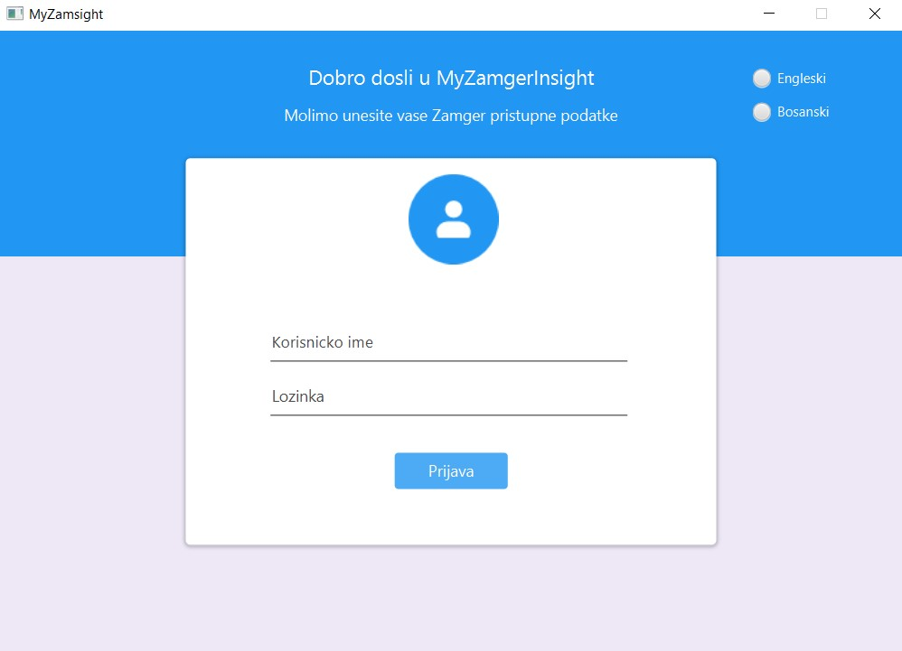
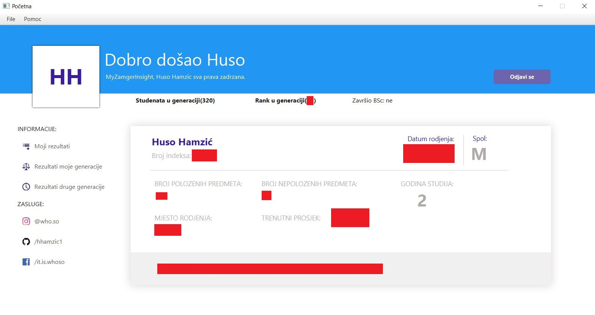
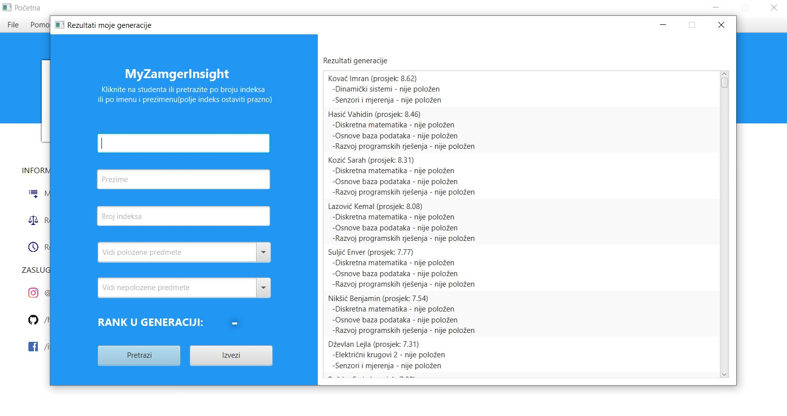
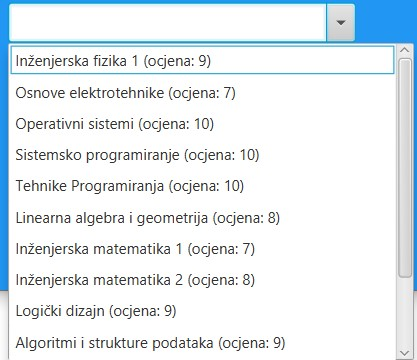
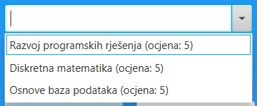
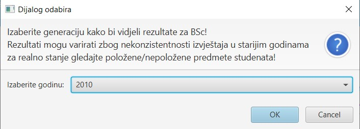
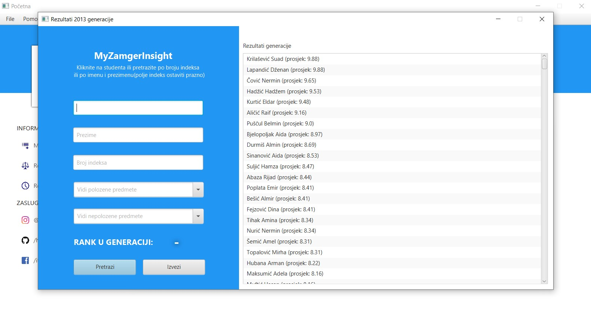

# MyZamgerInsight-RPR-projekat
Uvid u Zamger analitiku, prosjek, rank u generaciji kao i rezultate generacije i ostalih generacija od 2010- do danas.

Elektrotehnički fakultet Sarajevo

Razvoj programskih rješenja.

# Download link za executable(.exe pokretanje na dvoklik):
https://drive.google.com/file/d/1pyab-V9Cxa8zzTvzUReC047PslEYBAgz/view?fbclid=IwAR3mgz58mP4gZAiFSfgNj5IiuB5kPJCavo_9IKBXtBcnAZamLarsg3yFGFE

# Download link za .jar file(pokretanje iz cmd-a):
https://drive.google.com/drive/folders/1HoGAXvPWRriItE2v0ZqHQnld9oskgt9D

# Zasluge/Mentions:

Huso Hamzić(iskucao 95% koda od nule)

Enil Pajić (Pomoć oko Zamger API-a, ZamgerApiDemo klasa)

Tarik Horozović (.exe fajl)

Paša Džumhur, Mirza Učanbarlić (testiranje beta verzije aplikacije)

# Opis rada:

Nakon pokretanja aplikacije dočekuje Vas login screen u koji unosite Vaše studentske Zamger pristupne podatke.
Ako ste pravilno unijeli pristupne podatke, nakon par sekundi trebali bi doći na home screen(dash board)

(ovdje su sakriveni crvenim blokovima podaci o trenutnom korisniku, radi privatnosti.)
Korisnik ima uvid u njegov broj položenih predmeta, kao i nepoloženih, svoj prosjek, datum i mjesto rođenja, spol. Također i trenutni rank u generaciji(sortiranje studenata se vrši prvenstveno na osnovu broja položenih predmeta pa onda po prosjeku).

Klikom na dugme "Moji rezultati", trenutni korisnik dobija uvid u sve predmete koje je pohađao(ocjene iz istih)

Klikom na dugme "Rezultati moje generacije" korisnika dočekuje sljedeći prozor:

gdje trenutni korisnik ima uvid u čitavu svoju generaciju. Klikom na nekog studenta iz liste u polja(lijevo na slici) učitavaju se podaci o odabranom studentu(ime, prezime, broj indeksa, položeni predmeti sa ocjenama, nepoloženi predmeti kao i rank u generaciji), gdje trenutni korisnik može vidjeti ocjene svojih kolega iz predmeta koje su slušali npr:

(položeni predmeti)

(nepoloženi predmeti)

Također omogućena je i pretraga studenata po imenu i prezimenu studenata, kao i po broju indeksa(klikom na dugme "Pretrazi" ili pritiskom Enter na tastaturi) što olakšava pronalazak konkretnog studenta.

Omogućen je isto i uvid u ocjene i ranking svih generacija od 2010. g. do danas (Zamger izvještaji prije 2010. g. su dostupni samo adminima na Zamgeru).

Tu mogućnost dobijate klikom na dugme "Rezultati druge generacije" na home screenu, nakon čega vas dočekuje izbornik godina(gdje godina predstavlja početnu godinu od koje će se naredne 3. godine skupljati podaci):

nakon čega dolazite na ekran sličan onome ekranu "Rezultati moje generacije" ali sada samo sa podacima neke druge generacije koju je trenutni korisnik ranije odabrao. Zadržane su sve mogućnosti kao i ranije:

Također postoji i dugme "Izvezi" koji omogućuje da ranking studenata u formatu: ime, prezime, prosjek, broj položenih predmeta izvezete kao .pdf ili slično.

U menu baru možete izaći iz aplikacije(item "Izadji") ili promijeniti jezik aplikacije biranjem između Engleskog i Bosanskog jezika.

Klikom na "Help" pa na "O nama" u menu baru, dobijate informacije o aplikaciji.

I na kraju klikom na dugme "Odjavi se" vraćate se na login screen sa početka.

# Napomena:
Autor je svjestan da aplikacija barata sa „osjetljivim“ informacijama i radi toga je prvenstveno stavljen Zamger login jer je autor mišljenja da ovo sve mora ostati u krugovima ETF-a te da nikako ne smije izaći van njih. Još jednom napominjem da informacije o studentima nisu prikupljane ilegalno već da su one dostupne na internetu uz malo bolji Google search, te da ih autor ni na kakav način ne zloupotrebljava. Sve bugove i prijedloge za poboljšanje aplikacije pišite na: hhamzic1@etf.unsa.ba

#  Huso Hamzić,  © 2020
